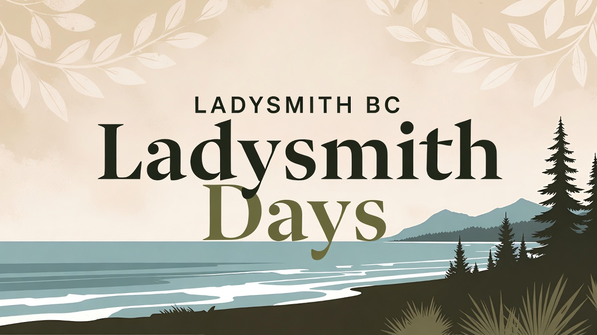

# Ladysmith Days



The official website for Ladysmith Days, an annual community celebration held on the first long weekend in Ladysmith, BC.

## About

Ladysmith Days is a beloved community event that brings together residents and visitors to celebrate the heritage and spirit of Ladysmith, British Columbia. Held annually on the first long weekend, the festival features local vendors, entertainment, activities, and more.

This website provides:
- Event schedule and information
- Sponsorship opportunities
- Volunteer registration
- Real-time countdown to the event

## Tech Stack

- **Framework**: Remix v2 with Vite
- **Runtime**: React 18.3
- **Styling**: Tailwind CSS
- **Testing**: Vitest (unit) and Playwright (E2E)
- **Hosting**: Vercel

## Getting Started

### Prerequisites

- Node.js >= 20.0.0
- npm or pnpm

### Installation

1. Clone the repository:
```bash
git clone <repository-url>
cd ladysmith-days
```

2. Install dependencies:
```bash
npm install
```

3. Run the development server:
```bash
npm run dev
```

The app will be available at `http://localhost:5173`

### Available Scripts

- `npm run dev` - Start development server
- `npm run build` - Build for production
- `npm run start` - Start production server
- `npm run test` - Run unit tests
- `npm run test:e2e` - Run E2E tests
- `npm run lint` - Lint code
- `npm run format` - Format code with Prettier

## Deployment

The site is hosted on **Vercel** with automatic deployments from the main branch.

### Manual Deployment

1. Build the application:
```bash
npm run build
```

2. The build output will be in the `build` directory, ready for deployment to Vercel.

## Project Structure

```
app/
├── components/     # React components
├── routes/         # Remix routes (file-based routing)
├── styles/         # Global styles
public/             # Static assets
```

## Contributing

Contributions are welcome! Please feel free to submit a Pull Request.

## License

All rights reserved.
